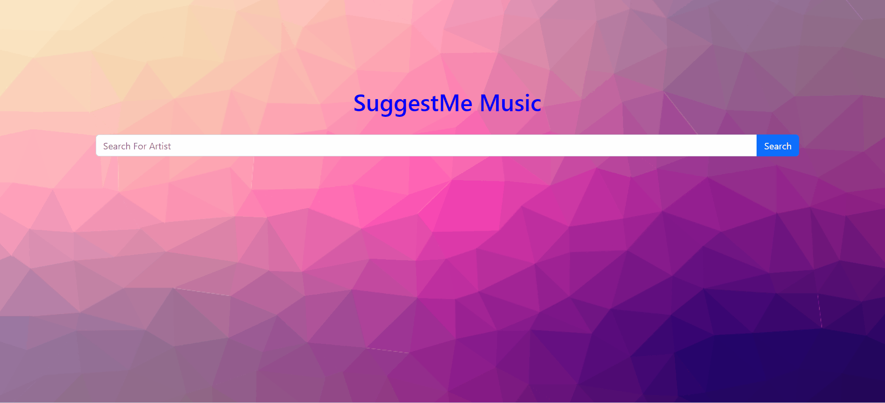

    

 
 

    

    <a href="#">Final Product</a>

 
  

    

    As a group, we plan to develop a web-based platform designed to help users discover artists who align with their personal interests and preferences, rather than solely based on their listening history. This platform aims to provide a more personalized and engaging experience by matching users with artists in specific genres and styles they are genuinely interested in.

 

    

    Music plays a vital role in human life, from ancient ceremonial music to modern hip-hop beats. It serves as a powerful means of expressing feelings, relaxing the mind, and finding satisfaction. To enhance the enjoyment of music based on individual preferences, rather than being limited by streaming platforms' algorithms, we are developing a web-based platform that provides personalized music recommendations.

    Our platform will understand users' interests and provide music tailored to their preferences, focusing on specific genres and artists they enjoy. With each search and interaction, the software will refine its understanding of the user's tastes, resulting in highly personalized recommendations. This approach ensures users receive music that aligns with their specific interests while remaining open to exploring new options.

    This project addresses a common frustration with popular music apps like Spotify, where algorithms often jump between different genres. By solving this problem, our platform offers a valuable alternative for music lovers seeking a more consistent and satisfying listening experience. This solution has the potential to attract a large user base and create significant business opportunities by meeting the needs of many music enthusiasts.

 

    

- <a href = "https://github.com/BinaryQuBit">Amandip Padda</a>

- <a href = "https://github.com/KeshiroM">Keshiro Abiola Mubarak</a>

- <a href = "https://github.com/SWARNIMKUMAR">Swarnim Kumar</a>

 

    

<h3 align = "center">👩‍💻 Languages</h3>

  
  
  

<h2></h2>

<h3 align="center">🚀 Development Tools & Environments</h3>

    
    

<h2></h2>

<h3 align="center">💻 Web Development Frameworks & Libraries</h3>

    
    
    
    
    
    
<h2></h2>

<h3 align="center">🌐 Web Servers</h3>

    
    

<h2></h2>

<h3 align="center">⚙️ Hardware and Microcontroller Boards</h3>

  

